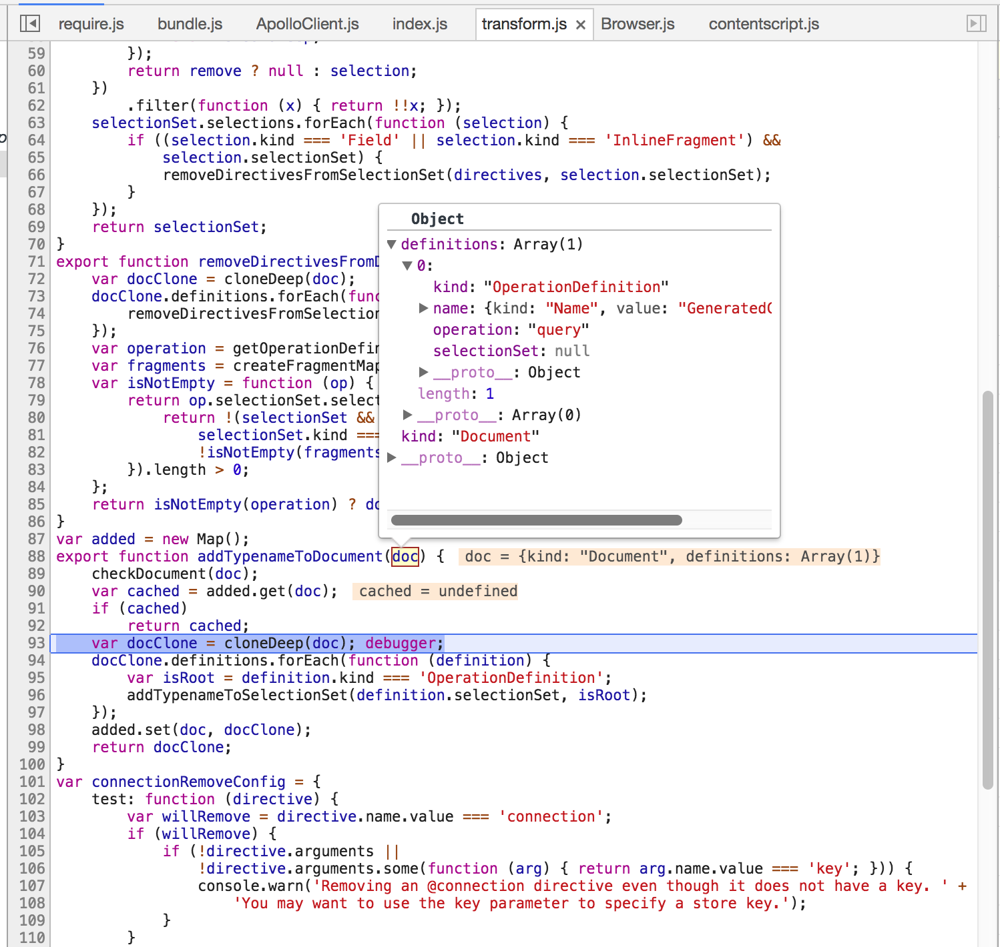

# Apollo link state error

## Reproduce the error
* run
```bash
yarn install && yarn start
```
* turned on the `develop tools`, and switch to the console tab
* click the `open` button
* in the console tab, it will show the following errors:
```
Uncaught (in promise) Error: Network error: Cannot read property 'selections' of null
    at new ApolloError (ApolloError.js:34)
    at Object.error (QueryManager.js:113)
    at SubscriptionObserver.error (zen-observable.js:174)
    at <anonymous>
```

## What I find
When the cache.writeData is running, it will fail at `node_modules/apollo-utilities/transforms`, 
due to there is a `graphql document` coming named: `GeneratedClientQuery`, 
which doesn't have selectionSet.

See 

